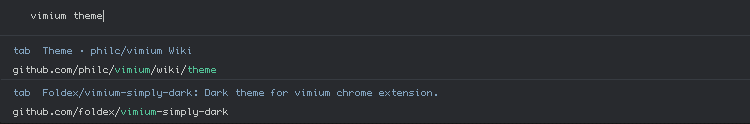
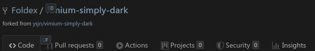
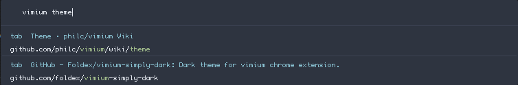
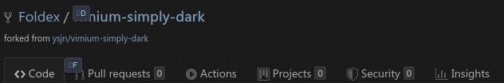

# vimium-dark

Dark themes for vimium chrome/firefox extension.
Forked from [vimium-simply-dark](https://github.com/ysjn/vimium-simply-dark)

## Usage
In Vimium Options: `Show Advanced Options` then paste into `CSS for Vimium UI`
Uncomment theme of choice to enable.

## Screenshots

### Tomorrow-Night

### Nord

### Doom One

